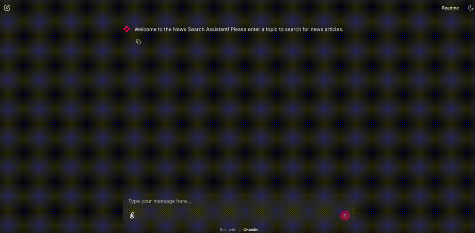

# EduAgent

​In the latest updates to the EduAgents open-source project, I've developed sampleAgent.py, a straightforward agent that connects to my local Large Language Model (LLM) to process simple prompts; searchNewsAgents.py, which combines two agents with a web search tool to collaboratively search and curate news articles based on user queries; and searchNewsChat.py, an interactive user interface that captures user input and integrates with the searchNewsAgents.py workflow to deliver tailored news content on specified topics.

